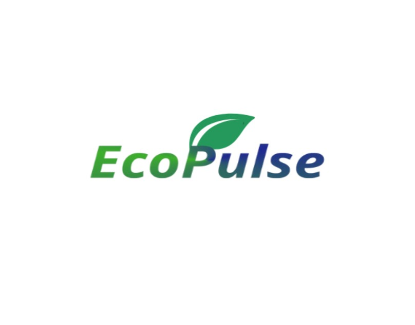

# EcoPulse-Logo-Design

# EcoPulse Logo Design

## 📌 Project Overview
EcoPulse is a **sustainable tech company** that focuses on eco-friendly gadgets and renewable energy solutions.  
This project contains the **wordmark logo design** created for EcoPulse.

## 🎨 Design Concept
- **Logo Type:** Wordmark  
- **Typography:** Modern, clean, slightly rounded font (techy yet friendly).  
- **Sustainability Element:** The curve of the "P" has been stylized into a subtle leaf shape.  
- **Color Palette:** Green and blue gradient, representing **eco-friendliness + innovation**.  

## 🖼️ Deliverables
- ✅ Primary wordmark logo (full color)  
- ✅ Black & white version  
- ✅ Logo on light & dark backgrounds  
- ✅ Optional: Animated version for social media or website headers  
- ✅ Favicon/small adaptation for app icon  

